# bs_test
 Just showing list of Repository and it's details

# Dependencies:
* get
* get_storage
* dio
* intl
* permission_handler
* workmanager
* pagination_view
* path_provider
* sqflite
* infinite_scroll_pagination
 

# Contents:

* SQfLite
* StaggeredGridView
* and many more...

# The Project:

You can run this project:

1. Direct on Android Studio Emulator by this [link](https://github.com/RashadZA/BS_Test)
2. Physical Device. [Apk_link](https://drive.google.com/file/d/1zAFxJrtGJ7CtYi3v56PLgJ6MpFUBQUUa/view?usp=sharing)

# Permission:
* Storage permission needed

# How to Use the Project:

* After install APK app will ask storage permission.
* Permission is needed for only for creating DB file.
* After permission granted data will save in DB for later use.
* Then open Home screen.

## Inside Structure of Lib Directory Screenshots
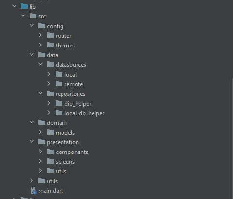
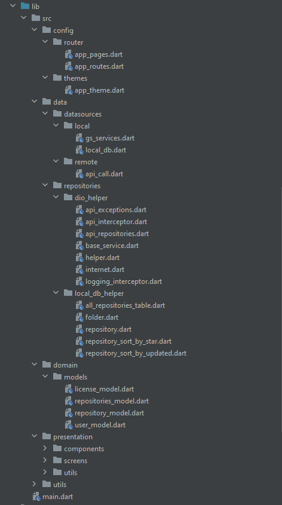
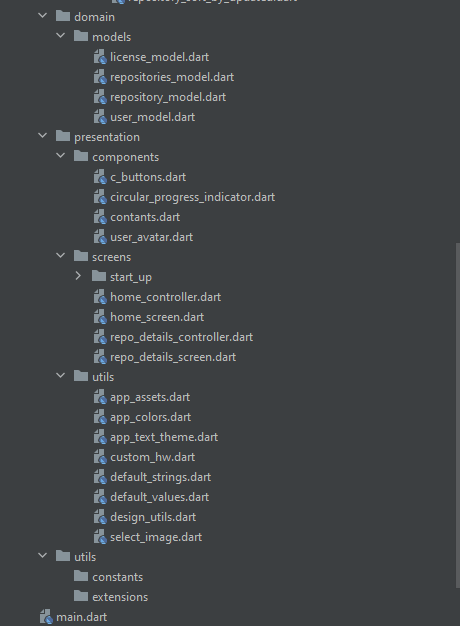

## APP Screenshots:
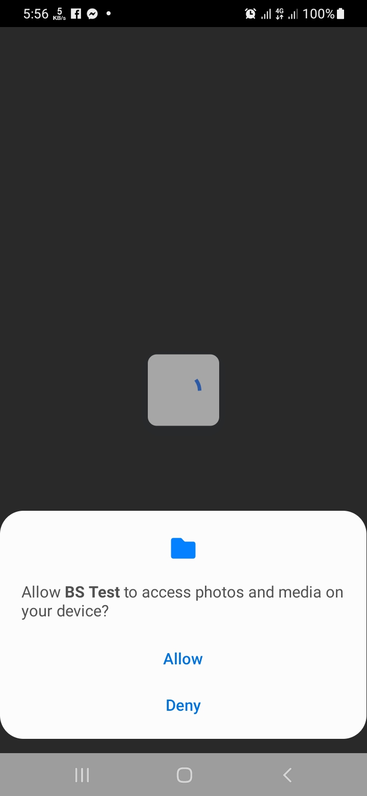

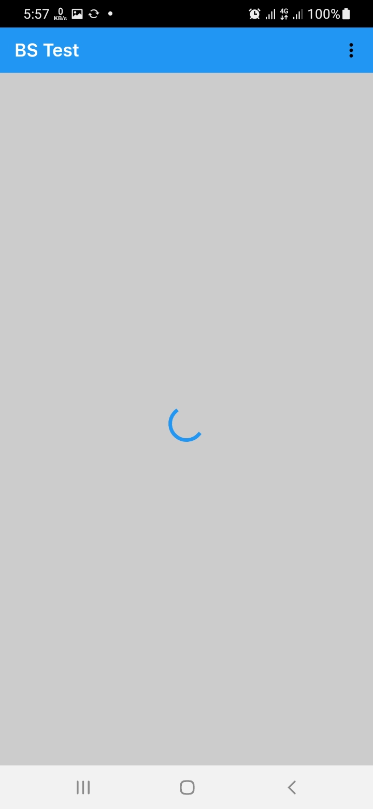
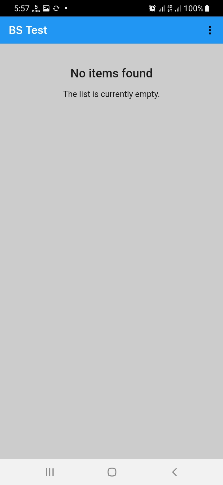
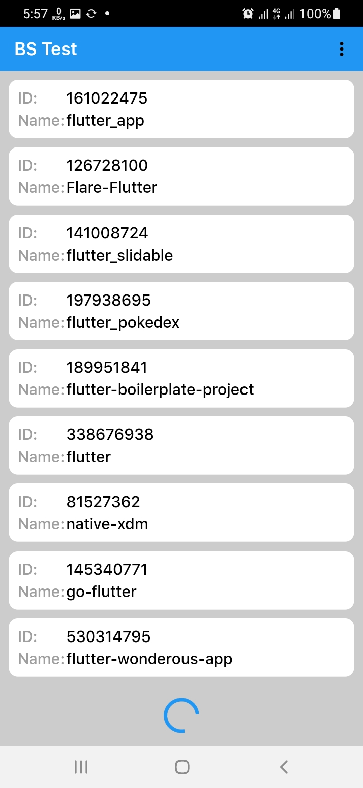
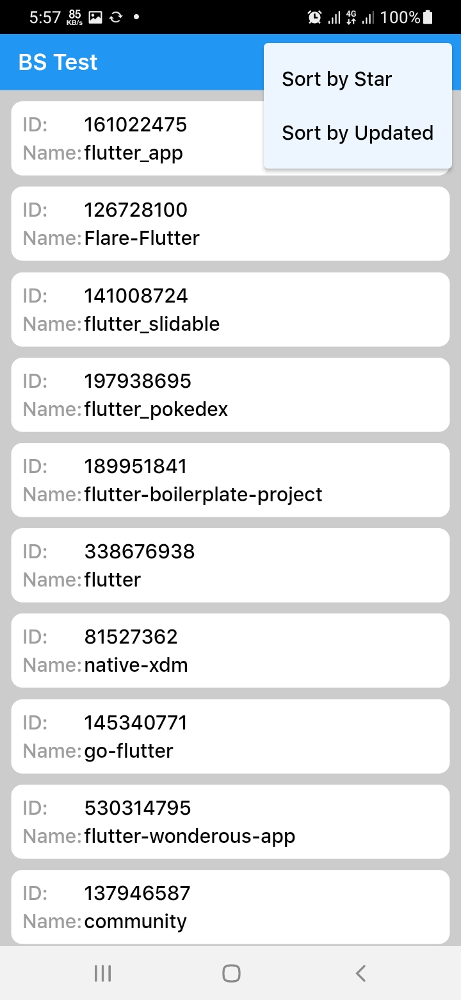
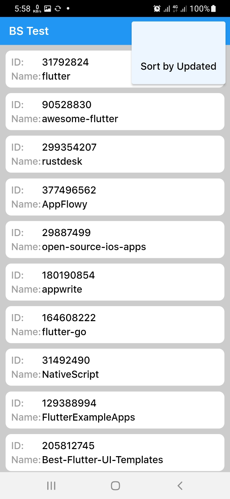

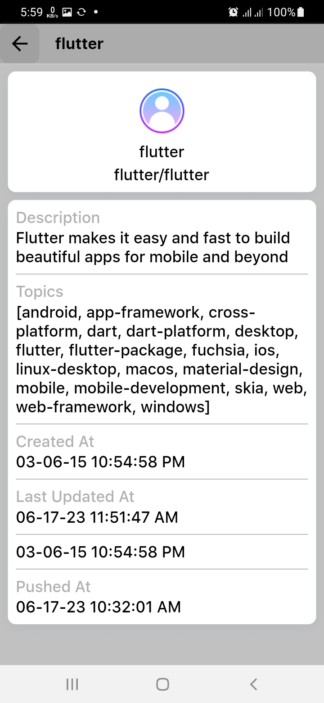
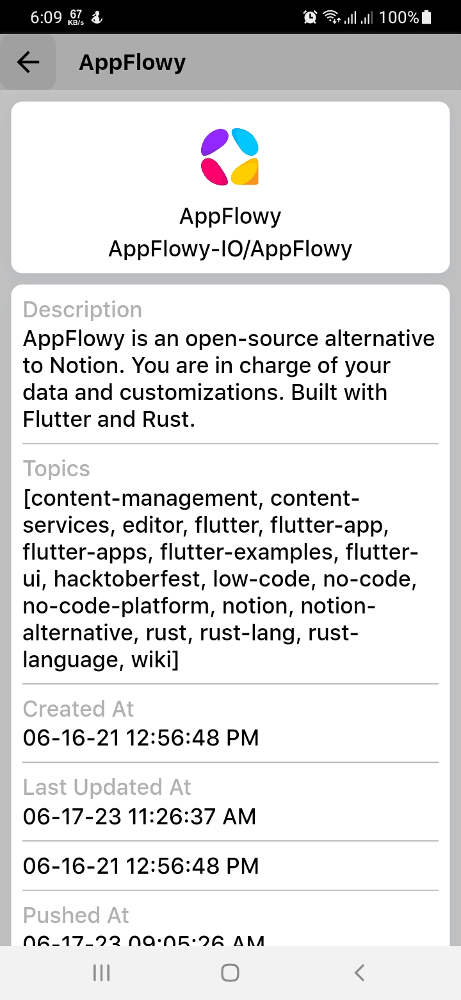
